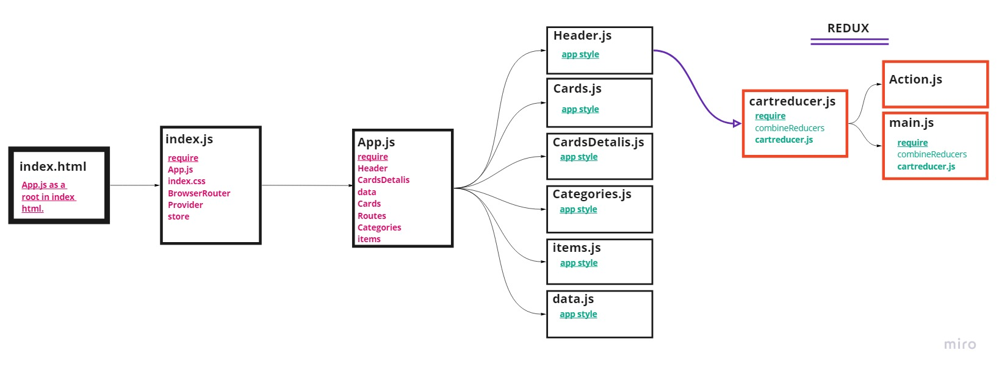

# storefront
E-Commerce storefront using React with Redux, coupled with your live API server.

## **Deploy**
[Shopping Cart](https://shoping-cart-store.netlify.app/)

## **Using**
- useContext
- useState
- useEffect
- useDispatch
- useParams
- useSelector
- Redux
- Test React
- Material ui
- React Bootstrap

## **UML Diagram**

